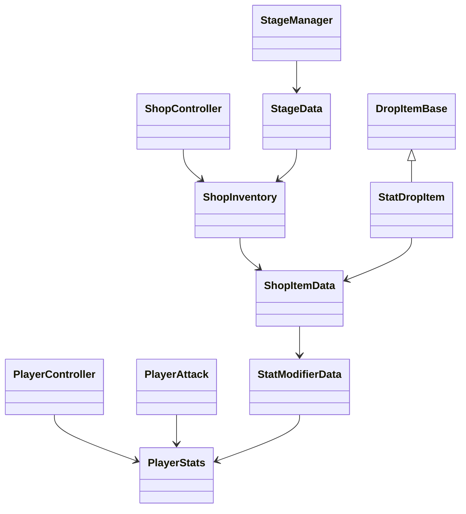

# Stage Shop And Stat Item Design

## 목표

스테이지 진행 중 플레이어의 스탯을 올려주는 아이템을 추가하고, 해당 아이템을 구매할 수 있는 상점을 스테이지 안에 배치한다.

설계의 핵심은 다음 세 가지다.

- 스탯 변경 로직을 `PlayerController`, `PlayerAttack`, `ShopUI`, 드랍 아이템에 흩뿌리지 않는다.
- 새 스탯 아이템은 가능하면 ScriptableObject 데이터 추가만으로 만들 수 있게 한다.
- 골드, 구매, 스탯 적용, UI 표시의 책임을 분리한다.

## 현재 코드에서 고려할 점

현재 플레이어 스탯은 `PlayerController`에 필드로 직접 존재한다.

- `maxHp`, `hpRegen`, `damage`, `attackSpeed`, `range`, `moveSpeed` 등은 `PlayerController`가 보유한다.
- `PlayerAttack`은 `PlayerController.PlayerStat()`으로 딕셔너리 스냅샷을 받아 무기 스탯을 계산한다.
- 레벨업 강화는 `LevelUp`이 `PlayerWeaponSO`의 강화값을 직접 수정한다.
- 골드는 `GameManager.Gold`와 `PlayerController.gold`가 동시에 존재한다.
- 아이템 수집은 `PickUp`, `PlayerPickup`이 `ExpGem`, `Meal` 타입을 직접 검사한다.

이 구조에 상점 아이템을 그대로 붙이면, 아이템이 늘어날수록 다음 문제가 생긴다.

- 스탯 변경 코드가 여러 클래스에 중복된다.
- 스탯이 바뀌어도 무기 공격력/공격속도/범위가 즉시 갱신되지 않을 수 있다.
- 골드 기준이 `GameManager`인지 `PlayerController`인지 모호해진다.
- 새 아이템 타입마다 `PickUp`, `PlayerPickup`, UI 코드를 수정해야 한다.

## 권장 아키텍처



## 새 타입 설계

### StatType

플레이어에게 적용 가능한 스탯 종류를 열거형으로 관리한다.

```csharp
public enum StatType
{
    MaxHp,
    HpRegen,
    HpAbs,
    Damage,
    ArmorPiercing,
    AttackSpeed,
    CritChance,
    Range,
    Armor,
    Evasion,
    MoveSpeed,
    PickupRange
}
```

문자열 딕셔너리 키 대신 enum을 쓰면 오타로 인한 버그를 줄일 수 있고, 새 스탯 추가 위치가 명확해진다.

### ModifierMode

스탯 증가 방식을 명시한다.

```csharp
public enum ModifierMode
{
    Flat,
    PercentAdd,
    PercentMultiply
}
```

- `Flat`: 최대 체력 +20, 공격력 +5 같은 고정 증가
- `PercentAdd`: 공격력 +10%, 이동속도 +15% 같은 합산형 증가
- `PercentMultiply`: 최종값 1.2배 같은 곱연산 증가

초기 구현은 `Flat`, `PercentAdd`만 지원해도 충분하다. `PercentMultiply`는 보스 보상이나 희귀 아이템용 확장 지점으로 남겨둘 수 있다.

### StatModifierData

스탯 하나를 어떻게 변경할지 표현하는 데이터다.

권장 위치:

- `Assets/01_Scripts/Data/Stats/StatModifierData.cs`
- 에셋 위치: `Assets/05_Data/StatModifiers`

필드 예시:

```csharp
[CreateAssetMenu(fileName = "StatModifier", menuName = "GamePlay/Stat Modifier")]
public class StatModifierData : ScriptableObject
{
    public string modifierId;
    public StatType statType;
    public ModifierMode mode;
    public float value;
    public int maxStack = 0;
}
```

`maxStack`은 0이면 제한 없음으로 처리한다.

### PlayerStats

플레이어의 런타임 스탯 계산을 담당하는 컴포넌트다.

권장 위치:

- `Assets/01_Scripts/Gameplay/Player/Stats/PlayerStats.cs`

책임:

- 기본 스탯 보관
- 스테이지 중 적용된 modifier 보관
- 최종 스탯 계산
- 스탯 변경 이벤트 발행

주요 API:

```csharp
public class PlayerStats : MonoBehaviour
{
    public event Action OnStatsChanged;

    public float GetValue(StatType statType);
    public bool CanApply(StatModifierData modifier);
    public bool ApplyModifier(StatModifierData modifier);
    public void ResetRuntimeModifiers();
}
```

`PlayerController`는 이동속도, 체력, 회복량 등을 직접 필드에서 읽지 않고 `PlayerStats.GetValue(...)`로 읽는다.

`PlayerAttack`은 `PlayerStats.OnStatsChanged`를 구독하고, 스탯이 바뀌면 `SetWeaponStat()`을 다시 호출한다.

### ShopItemData

상점에서 판매하는 아이템 하나의 데이터다.

권장 위치:

- `Assets/01_Scripts/Data/Shop/ShopItemData.cs`
- 에셋 위치: `Assets/05_Data/Shop/Items`

필드 예시:

```csharp
[CreateAssetMenu(fileName = "ShopItem", menuName = "GamePlay/Shop Item")]
public class ShopItemData : ScriptableObject
{
    public string itemId;
    public string displayName;
    [TextArea] public string description;
    public Sprite icon;
    public int price;
    public List<StatModifierData> modifiers;
    public int maxPurchaseCount = 0;
}
```

`maxPurchaseCount`가 0이면 구매 제한 없음으로 처리한다.

### ShopInventory

스테이지 상점이 어떤 아이템을 팔지 정의하는 데이터다.

권장 위치:

- `Assets/01_Scripts/Data/Shop/ShopInventory.cs`
- 에셋 위치: `Assets/05_Data/Shop/Inventories`

필드 예시:

```csharp
[CreateAssetMenu(fileName = "ShopInventory", menuName = "GamePlay/Shop Inventory")]
public class ShopInventory : ScriptableObject
{
    public List<ShopItemData> items;
    public bool randomize;
    public int randomPickCount;
}
```

초기에는 고정 판매 목록만 구현하고, 이후 `randomize`와 `randomPickCount`로 랜덤 상점 확장이 가능하다.

### ShopController

상점의 런타임 로직을 담당하는 MonoBehaviour다.

권장 위치:

- `Assets/01_Scripts/Gameplay/Shop/ShopController.cs`

책임:

- 플레이어 상호작용 범위 감지
- 상점 UI 열기/닫기
- 구매 가능 여부 판단
- 골드 차감
- `PlayerStats.ApplyModifier(...)` 호출
- 구매 횟수 기록

주요 API:

```csharp
public class ShopController : MonoBehaviour
{
    public void Initialize(ShopInventory inventory);
    public bool CanPurchase(ShopItemData item);
    public bool TryPurchase(ShopItemData item);
}
```

`TryPurchase`의 처리 순서:

1. 아이템이 판매 목록에 있는지 확인한다.
2. 구매 제한을 확인한다.
3. 플레이어 골드가 충분한지 확인한다.
4. 모든 modifier가 적용 가능한지 확인한다.
5. 골드를 차감한다.
6. modifier를 적용한다.
7. 구매 횟수와 UI를 갱신한다.

### ShopUI

상점 표시와 버튼 입력만 담당한다.

권장 위치:

- `Assets/01_Scripts/UI/InGame/ShopUI.cs`
- 프리팹 위치: `Assets/03_UI/Shop`

UI는 직접 골드를 차감하거나 스탯을 수정하지 않는다. 버튼 클릭 시 `ShopController.TryPurchase(item)`만 호출한다.

### StatDropItem

상점 구매뿐 아니라 몬스터 드랍이나 보스 보상으로도 같은 스탯 아이템을 쓸 수 있게 하는 아이템이다.

권장 위치:

- `Assets/01_Scripts/Gameplay/Item/StatDropItem.cs`

```csharp
public class StatDropItem : DropItemBase
{
    [SerializeField] private ShopItemData itemData;

    public override void Collect(PlayerController player)
    {
        PlayerStats stats = player.GetComponent<PlayerStats>();
        if (stats == null) return;

        foreach (StatModifierData modifier in itemData.modifiers)
        {
            stats.ApplyModifier(modifier);
        }

        ReturnToPool();
    }
}
```

상점 아이템과 드랍 아이템이 같은 `ShopItemData`를 공유하면 데이터 중복을 줄일 수 있다.

## 기존 코드 변경 포인트

### PlayerController

`PlayerStats`를 참조하도록 변경한다.

권장 변경:

- 기존 serialized stat 필드는 `PlayerStats`로 이동한다.
- 체력 계산, 회복, 이동속도 계산에서 `PlayerStats.GetValue(...)` 사용.
- `PlayerStat()`의 문자열 딕셔너리는 단계적으로 제거한다.

단기 호환용으로는 `PlayerStat()`을 유지하되 내부에서 `PlayerStats` 값을 읽게 바꿀 수 있다.

### PlayerAttack

현재 `GetPlayerStat()`이 딕셔너리 스냅샷을 저장한다. 스탯 아이템 적용 후 값이 자동 반영되려면 이벤트 구독이 필요하다.

권장 변경:

```csharp
private PlayerStats playerStats;

private void Awake()
{
    playerController = GetComponentInParent<PlayerController>();
    playerStats = playerController.GetComponent<PlayerStats>();
}

private void OnEnable()
{
    if (playerStats != null)
    {
        playerStats.OnStatsChanged += SetWeaponStat;
    }
}

private void OnDisable()
{
    if (playerStats != null)
    {
        playerStats.OnStatsChanged -= SetWeaponStat;
    }
}
```

이후 `SetWeaponStat()` 내부는 `playerStats.GetValue(StatType.Damage)`처럼 직접 조회한다.

### GameManager

골드는 상점 결제 기준이 되므로 단일 소스가 필요하다.

권장 변경:

```csharp
public bool TrySpendGold(int amount)
{
    if (amount < 0) return false;
    if (Gold < amount) return false;

    Gold -= amount;
    OnGoldChanged?.Invoke(Gold);
    return true;
}

public void AddGold(int amount)
{
    if (amount <= 0) return;

    Gold += amount;
    OnGoldChanged?.Invoke(Gold);
}
```

`PlayerController.gold`, `SetGold`, `GetNowGold`는 새 코드에서 사용하지 않도록 정리한다.

### PickUp, PlayerPickup

구체 타입 검사 대신 인터페이스나 베이스 클래스로 처리한다.

권장 변경:

```csharp
if (collision.TryGetComponent(out DropItemBase item))
{
    item.Pull(transform, pullSpeed);
}
```

```csharp
if (collision.TryGetComponent(out ICollectable collectable))
{
    collectable.Collect(parentPC);
}
```

이렇게 하면 `StatDropItem`, `GoldDropItem`, `BuffDropItem`이 추가되어도 수집 코드 수정이 필요 없다.

### StageData, StageManager

스테이지별 상점 구성을 데이터로 연결한다.

`StageData` 추가 필드:

```csharp
[Header("상점 데이터")]
public ShopInventory shopInventory;
public GameObject shopPrefab;
public Vector3 shopSpawnPosition;
```

`StageManager.InitializeStage()`는 맵 생성 후 상점 프리팹을 생성하고 inventory를 주입한다.

## 폴더 구조 제안

```text
Assets/
  01_Scripts/
    Data/
      Stats/
        StatType.cs
        StatModifierData.cs
      Shop/
        ShopItemData.cs
        ShopInventory.cs
    Gameplay/
      Player/
        Stats/
          PlayerStats.cs
      Shop/
        ShopController.cs
        ShopInteraction.cs
      Item/
        StatDropItem.cs
    UI/
      InGame/
        ShopUI.cs
        ShopItemSlotUI.cs
  03_UI/
    Shop/
      ShopCanvas.prefab
      ShopItemSlot.prefab
  05_Data/
    StatModifiers/
    Shop/
      Items/
      Inventories/
```

## 구현 순서

1. `StatType`, `ModifierMode`, `StatModifierData`, `PlayerStats`를 만든다.
2. `PlayerController`가 `PlayerStats`를 통해 이동속도, 최대 체력, 회복량을 읽게 한다.
3. `PlayerAttack`이 `PlayerStats.OnStatsChanged`를 구독하고 무기 스탯을 재계산하게 한다.
4. `GameManager`에 `TrySpendGold(int amount)`, `AddGold(int amount)`를 추가하고 골드 기준을 단일화한다.
5. `ShopItemData`, `ShopInventory`를 만들고 테스트용 공격력/이동속도/최대 체력 아이템 에셋을 만든다.
6. `ShopController`와 `ShopUI`를 구현한다.
7. `StageData`, `StageManager`에 상점 프리팹과 상점 인벤토리를 연결한다.
8. `PickUp`, `PlayerPickup`을 구체 타입 분기에서 인터페이스 기반으로 정리한다.
9. `StatDropItem`을 추가해 상점 아이템 데이터를 드랍 보상으로도 재사용할 수 있게 한다.

## 테스트 체크리스트

- 상점 범위에 들어가면 UI가 열린다.
- 골드가 부족하면 구매 버튼이 비활성화되거나 구매 실패 메시지가 표시된다.
- 골드가 충분하면 구매 후 골드가 차감된다.
- 공격력 아이템 구매 후 기존 무기의 데미지가 즉시 증가한다.
- 공격속도 아이템 구매 후 기존 무기의 공격 주기가 즉시 짧아진다.
- 이동속도 아이템 구매 후 플레이어 이동속도가 즉시 증가한다.
- 최대 체력 아이템 구매 후 HP UI가 새 최대 체력을 기준으로 갱신된다.
- 구매 제한이 있는 아이템은 제한 횟수 이후 구매할 수 없다.
- 스테이지를 새로 시작하면 스테이지 한정 스탯 강화가 초기화된다.
- 새 `StatDropItem`을 추가해도 `PickUp`, `PlayerPickup` 코드를 수정하지 않아도 된다.

## 리스크와 대응

- `PlayerWeaponSO`가 런타임 강화값을 ScriptableObject 내부에 저장하고 있으므로 플레이 종료 후 값이 남을 수 있다.
  - 단기 대응: 현재의 `ResetStatUpgrade()` 호출 위치를 명확히 한다.
  - 장기 대응: 무기 런타임 상태를 ScriptableObject 원본과 분리한다.
- `PlayerAttack`의 공격 루프가 코루틴 기반이므로 공격속도 변경 타이밍이 즉시 반영되지 않을 수 있다.
  - 대응: 다음 공격 대기부터 새 공격속도를 적용하는 정책으로 시작하고, 필요하면 코루틴 재시작을 추가한다.
- `Time.timeScale = 0` 상태에서 상점 UI를 열 경우 UI 애니메이션과 입력 처리 정책이 필요하다.
  - 대응: 상점은 일시정지형 UI인지, 실시간 구매형 NPC인지 먼저 정하고 `GameManager` pause state에 `Shop`을 추가한다.

## 권장 정책

초기 버전에서는 상점 UI를 열 때 게임을 일시정지하는 방식을 추천한다. 현재 레벨업 UI도 `GameManager.PauseGame()`을 사용하므로 플레이 경험과 구현 방식이 일관된다.

골드는 `GameManager` 기준으로 통일한다. `PlayerController`의 골드 필드는 새 상점 코드에서 사용하지 않는다.

스탯 아이템은 모두 `ShopItemData`와 `StatModifierData` 조합으로 만든다. 코드로 `AttackPotion`, `SpeedPotion` 같은 클래스를 계속 늘리지 않는다.
